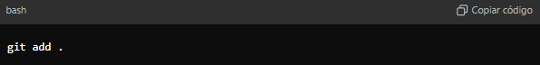

# Projeto App Coletor de Informações de Pets e seus Tutores

## Sobre o Projeto 
Este é um projeto simples em Python que coleta informações sobre um pet e seu tutor, como nome, idade, peso, endereço e outras informações básicas.
O objetivo é treinar coleta de dados no terminal e exibir as informações de maneira organizada.

## Funcionalidades do coletor
- Coleta o **nome do tutor** e **endereço**.
- Coleta o **nome do pet**, **idade** e **peso**.
- Validação dos dados de **idade** e o **peso** para garantir que sejam valores númericos e positivos.
- Exibe as informações coletadas no terminal de forma clara e organizada.

## Tecnologias utilizadas
- Python 3.12.6: Linguagem de programação utilizada para desenvolver o projeto.
- Visual Studio Code: Editor usado com o Python.
- Flask: Framework para o desenvolvimento web.

## Layout

Imagem na web do app

## Como Contribuir

### Pré-Requisitos

- [Python 3.12.6](https://www.python.org/downloads/)
- [Visual Studio Code](https://code.visualstudio.com/Download)
- [Flask](https://flask.palletsprojects.com/en/3.0.x/)

1. No GitHub, clique em Fork no topo direito da página do repositório para criar uma cópia no seu perfil

2. CLone seu fork localmente

   

3. Crie uma **nova branch** com a sua feature: *git checkout -b "minha-feature"*

4. Faça as alterações necessárias no código e salve as mudanças.

5. Adicione os arquivos alterados: *"git add ."* (ou nome do arquivo no lugar do ponto)
 
 
   
6. Faça um commit das suas alterações com uma mensagem clara e objetiva: *git commit -m "Descrição das alterações"

7. Faça um **push** para a branch enviando as mudanças para o seu repositório: *git push origin minha-feature*

8. No GitHub, abra um **pull request** para o repositório original, explicando suas modificações.

  ## **_Detalhes importantes:_**
  >Certifique-se de que o seu código está funcionando corretamente antes de abrir um pull request.
  >Siga os padrões de commit para garantir que as mensagens sejam claras e que facilitam o entendimento das alterações.
   
   # Licença
   Este projeto está sob a licença do MIT. Consulte a [LICENSE](https://github.com/michelle-sstudart/Projeto-Versionamento-Ada/blob/main/LICENSE) para obter mais informações.
  
  # Diretrizes para contribuir
  1. Siga as diretrizes do [CONTRIBUTING.md]

[def]: image.png